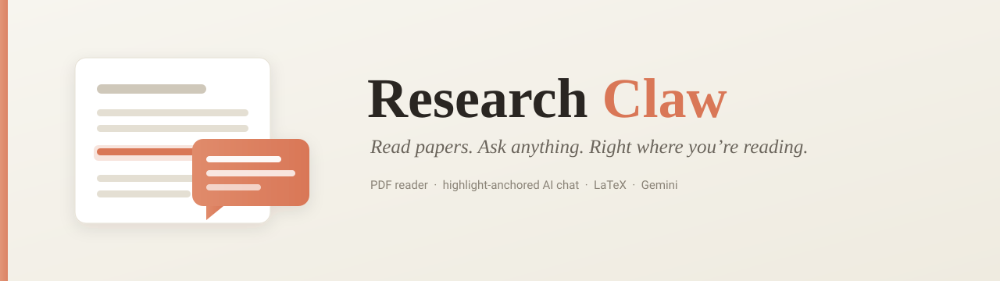
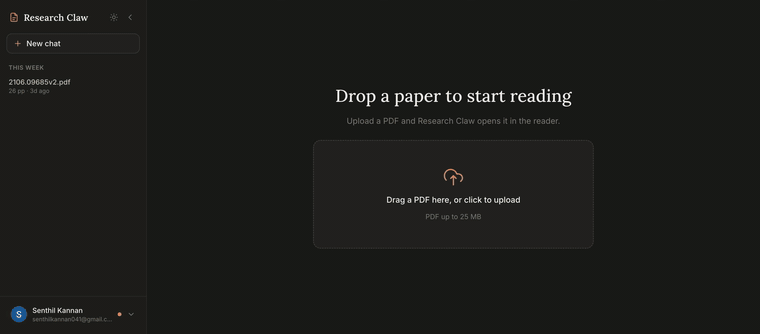

<p align="center">
  
</p>

<h1 align="center">Research Claw</h1>

<p align="center">
  <em>A research-paper reader with an AI that lives inside your highlights.</em><br/>
  Upload a PDF, highlight a passage, and ask about it — right where you're reading.
</p>

<p align="center">
  
  
  
  
  
  
</p>

---

## 🎬 Demo



> ▶️ Sped up for preview — **[watch the full walkthrough with audio](https://github.com/senthil2405/research-claw/raw/develop/docs/demo.webm)**.

Drag in a PDF → it renders instantly → select a sentence → a chat icon floats over the selection → ask *"explain this"* → a chat window opens anchored to the highlight and streams a Markdown + LaTeX answer.

---

## ✨ Features

- **📄 Chrome-quality PDF reader** — drag-and-drop upload, continuous virtualized scroll, a thumbnail rail, page jumping, and trackpad pinch-to-zoom. Recolored to a warm, paper-like palette.
- **🖍️ Highlight-anchored chat** — select any passage and a chat icon appears over it. Each highlight opens a floating, draggable/resizable chat "window" that minimizes to a chip on the text.
- **🧠 Ask in context** — every question is grounded in the passage you highlighted; all windows for a PDF share one conversation, so follow-ups across the document stay coherent.
- **➗ Real math & Markdown** — answers render Markdown *and* LaTeX via KaTeX (inline `$…$`, block `$$…$$`, and backslash `\(…\)` / `\[…\]` from any model).
- **⚡ Streaming replies** — tokens stream in with a smooth typewriter reveal.
- **🔐 Sign in or stay anonymous** — Google login (Auth.js) or a zero-friction anonymous session; anonymous documents migrate to your account when you sign in.
- **🎛️ Fair-use token budgets** — a monthly per-account token budget plus hard per-window (50k) and per-PDF (500k) caps, with a friendly "you're out of tokens" prompt.

---

## 🧩 How it works

```
                    ┌──────────────────────────────────────────────┐
   Browser          │  Next.js (App Router) — React 19 + RSC        │
   ─ react-pdf      │                                              │
   ─ react-query    │   /api/documents/[id]/chat[/stream]          │
   ─ zustand        │        │                                     │
                    │        ▼                                     │
                    │  services/chat.ts ─ replay history ─▶ llm.ts  │──▶  Gemini API
                    │        │  (per-doc lock, token metering)      │    (2.5 Flash)
                    │        ▼                                     │
                    │   Prisma 6 ──▶ PostgreSQL   ·   file storage │
                    └──────────────────────────────────────────────┘
                                              (local FS  ·  Cloudflare R2)
```

- **Chat backend** — `src/server/llm.ts` talks to the **Google AI (Gemini) Developer API** (`gemini-2.5-flash`). There's no server-side session, so each turn **replays the document's conversation** from the DB; usage (including thinking + cached tokens) is metered per turn.
- **Highlights & windows** — a highlight stores normalized rectangles so it survives zoom and reload; one `ChatSession` per PDF ties every window together.
- **Metering** — billable tokens (`completion + uncached prompt`) roll up into per-owner, per-window, and per-document counters, enforced before each turn.
- **Offline by default in dev/CI** — set `LLM_FORCE_MOCK=true` and the whole app works without any API key or spend (used by the test suite).

---

## 🛠️ Tech stack

| Area | Choices |
|---|---|
| **Framework** | Next.js 16 (App Router, Turbopack), React 19, TypeScript |
| **Auth** | Auth.js v5 (Google OAuth + dev mock), JWT sessions |
| **Data** | Prisma 6, PostgreSQL |
| **PDF** | react-pdf 10 / pdf.js 5, react-dropzone |
| **State / data** | @tanstack/react-query, @tanstack/react-virtual, zustand |
| **Rendering** | react-markdown, remark-gfm, remark-math, rehype-katex (KaTeX) |
| **LLM** | Google AI (Gemini) Developer API — `gemini-2.5-flash` |
| **Storage** | Local filesystem (dev) or Cloudflare R2 (prod) |
| **Hosting** | Fly.io + Supabase Postgres |
| **Testing** | Vitest (unit/integration) + Playwright (E2E) |

---

## 🚀 Getting started

### Prerequisites
- **Node 22+** and **PostgreSQL 16** (locally: `brew install postgresql@16`)
- A **Gemini API key** ([ai.studio](https://ai.studio)) — optional; omit it to run on the mock.

### Setup

```bash
# 1. Install
npm install

# 2. Configure env
cp .env.example .env.local     # then fill in the values (see below)

# 3. Create the database + apply migrations
createdb research_claw
npx prisma migrate dev

# 4. Run
npm run dev                    # http://localhost:3000
```

### Environment

The essentials for local dev (full list in [`.env.example`](.env.example)):

```bash
DATABASE_URL="postgresql://<user>@localhost:5432/research_claw?schema=public"
DIRECT_DATABASE_URL="postgresql://<user>@localhost:5432/research_claw?schema=public"
AUTH_SECRET="<npx auth secret>"
ALLOW_DEV_LOGIN="true"                 # one-click "Sign in as Test User"

# LLM (leave empty or set LLM_FORCE_MOCK=true to use the offline mock)
GEMINI_API_KEY="AQ.…"
GEMINI_MODEL="gemini-2.5-flash"
LLM_FORCE_MOCK="false"
```

---

## 🧪 Testing

```bash
npm run typecheck     # tsc --noEmit
npm run test          # Vitest — unit + DB-backed integration
npm run test:e2e      # Playwright — full flow against the mock LLM
```

The suites force `LLM_FORCE_MOCK=true`, so they never spend real tokens and don't need an API key.

---

## 🚢 Deployment & branching

Hosted on **Fly.io** (`research-claw`, region `sin`); the release command runs `prisma migrate deploy` against Supabase Postgres.

| Branch | Role |
|---|---|
| `develop` | staging — commit work here and run the gate |
| `master` | production — pushing here runs CI and deploys to Fly |

**Flow:** commit to `develop` → `npm run typecheck && npm run test && npm run test:e2e` → fast-forward `master` to `develop` → push. CI (`.github/workflows/ci.yml`) runs the gate on `develop`, `master`, and PRs, and deploys only from `master` (needs a `FLY_API_TOKEN` repo secret).

```bash
# release
git checkout master && git merge --ff-only develop && git push
git checkout develop
```

---

## 📁 Project structure

```
src/
├─ app/                      # App Router routes + API (/api/documents, /api/me, /api/auth)
├─ components/
│  ├─ viewer/                # PDF viewer, highlight layer, chat windows, Markdown/KaTeX
│  └─ sidebar/               # doc history, user menu, account modals
├─ hooks/                    # react-query hooks (chat stream, usage, auth)
├─ server/
│  ├─ llm.ts                 # Gemini transport (generate + stream, usage parsing)
│  ├─ services/chat.ts       # history replay, persistence, token caps
│  ├─ services/usage.ts      # per-owner budget + billable-token metering
│  └─ owner.ts, env.ts, db.ts
└─ lib/                      # shared types + constants
prisma/                      # schema + migrations
```

---

<p align="center"><sub>Built with Next.js, Prisma, and Gemini — a warm place to read cold papers.</sub></p>
